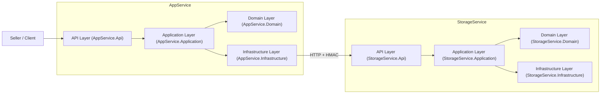
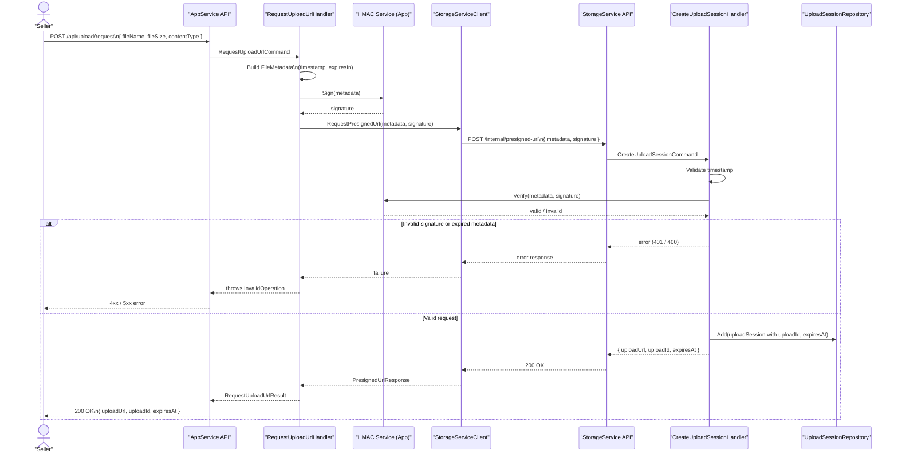
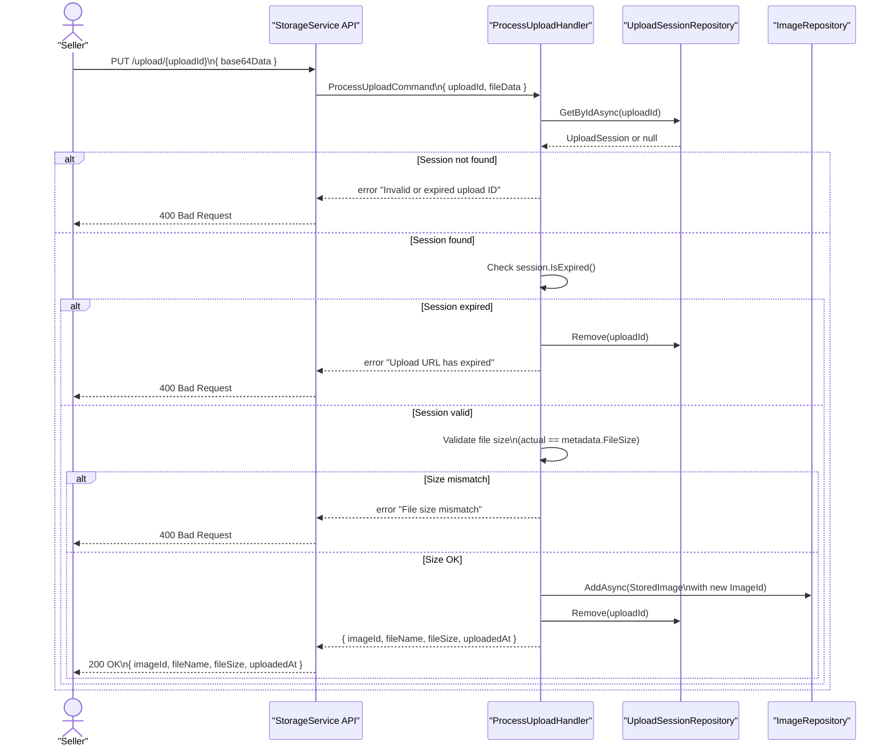
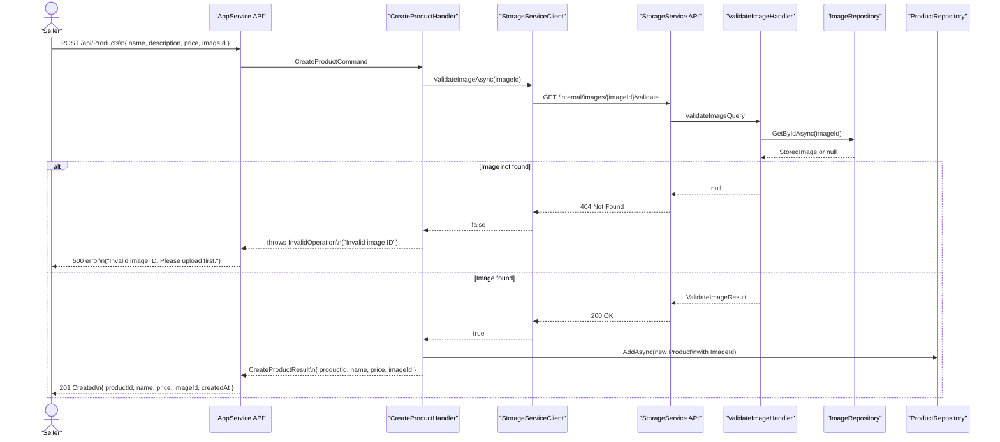
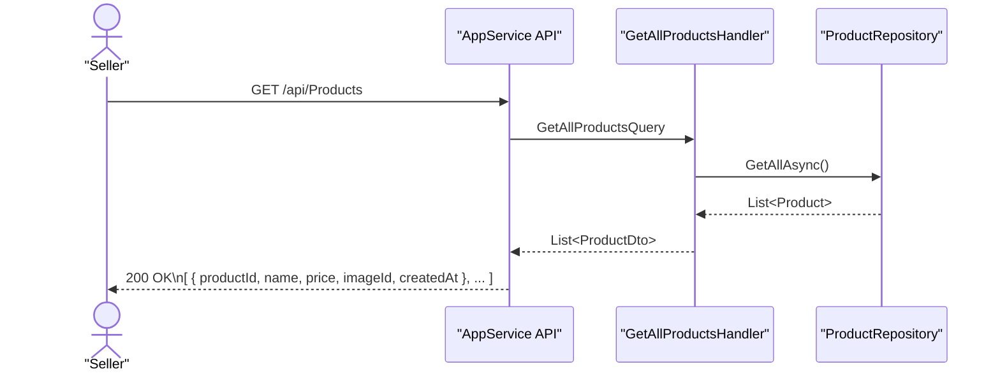
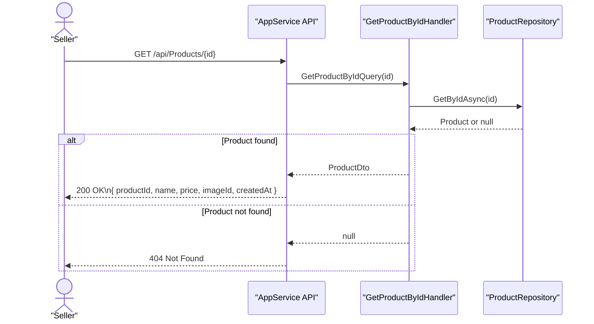

# Project Summary

This solution implements a secure file upload workflow using two microservices:

* **AppService** — exposes public APIs for sellers to upload product images and create products.
* **StorageService** — securely handles image uploads using pre-signed URLs and validates uploaded images.

The system uses HMAC signatures to ensure metadata integrity when generating pre-signed URLs, enforcing secure inter-service communication.

---


## Quick Setup

```bash
# 1. Build and run
docker-compose up --build

# 2. Test
chmod +x test-workflow.sh
./test-workflow.sh
```

---


# HMAC Security Model

HMAC is used only when requesting a pre-signed upload URL.

## Why?

To ensure that:

* Metadata cannot be tampered with
* Only AppService can generate upload URLs
* StorageService trusts the upload contract
* Upload sessions cannot be forged or replayed

## What is signed?

AppService signs the full `FileMetadata`:

```json
{
  "fileName": "...",
  "fileSize": 12345,
  "contentType": "image/png",
  "timestamp": 1700000000,
  "expiresIn": 3600
}
```

StorageService recomputes the HMAC using the shared secret and rejects any mismatches.

This makes the URL truly "pre-signed".

---


# API Endpoints Summary

## AppService

| Method | Endpoint              | Purpose                              |
| ------ | --------------------- | ------------------------------------ |
| POST   | `/api/upload/request` | Request pre-signed URL (HMAC-signed) |
| POST   | `/api/products`       | Create product using imageId         |
| GET    | `/api/products`       | List all products                    |
| GET    | `/api/products/{id}`  | Get product by ID                    |

## StorageService

| Method | Endpoint                              | Purpose                             |
| ------ | ------------------------------------- | ----------------------------------- |
| POST   | `/internal/presigned-url`             | Verify HMAC + create upload session |
| PUT    | `/upload/{uploadId}`                  | Upload image using pre-signed URL   |
| GET    | `/internal/images/{imageId}/validate` | Validate image exists               |
| GET    | `/images/{imageId}`                   | Download image                      |

---


## API Authentication

AppService endpoints require API key authentication. Include the following header in your requests:

```
X-API-Key: seller-secret-key-12345
```

This key should be used when testing with Swagger or any HTTP client (Postman, curl, etc.).

---


# Architecture Overview

## 1. System Level – Microservices Architecture

### End-to-End Workflow Overview

The full upload + product creation workflow works as follows:

1. **Seller requests a pre-signed upload URL** from AppService. AppService signs the `FileMetadata` with HMAC and forwards it to StorageService.
2. **StorageService validates the signature** and creates an `UploadSession`. It returns a time-limited pre-signed URL.
3. **Seller uploads the image** using the pre-signed URL. StorageService validates:
   * Upload session exists
   * Not expired
   * File size matches metadata
   
   It then stores the image and returns an `imageId`.
4. **Seller creates a product** in AppService using the `imageId`. AppService calls StorageService to validate the image existence. If valid, AppService saves the product.
5. **Seller can list or retrieve the product.**

---


The solution follows a microservices architecture with two independent services:

###  App Service

* Owns Products
* Exposes authenticated public APIs for the seller
* Handles:
   * Requesting pre-signed upload URLs
   * Creating products linked to images
   * Listing and retrieving products
* Communicates with Storage Service via HTTP + HMAC-signed requests

###  Storage Service

* Owns Images and Upload Sessions
* Issues pre-signed upload URLs
* Verifies HMAC signatures to ensure integrity
* Stores uploaded image data (in-memory)
* Validates `ImageId` when AppService creates a product

### Service-to-Service Communication

* **Protocol:** HTTP (REST)
* **Format:** JSON
* **Security:** HMAC SHA-256 signatures using a shared secret
* **Purpose:** Prevents tampering and unauthorized upload requests

## 2. Service Level – Clean / Layered Architecture

Each microservice follows a Clean Architecture layout with 4 isolated layers:

```
ServiceName/
  ├── ServiceName.Domain
  ├── ServiceName.Application
  ├── ServiceName.Infrastructure
  └── ServiceName.Api
```

### 2.1 Domain Layer (`*.Domain`)

The Domain layer contains the core business logic.

**Contains:**

* **Entities**
   * AppService → `Product`
   * StorageService → `UploadSession`, `StoredImage`
* **Value Objects**
   * `FileMetadata`
* **Repository Interfaces**
   * `IProductRepository`
   * `IUploadSessionRepository`
   * `IImageRepository`

**Characteristics:**

* Pure POCOs
* No external dependencies
* Contains business rules and invariants

### 2.2 Application Layer (`*.Application`)

The Application layer contains the use cases and workflows.

**Contains:**

* **Commands & Queries (MediatR)**
   * `CreateProductCommand`
   * `RequestUploadUrlCommand`
   * `CreateUploadSessionCommand`
   * `ProcessUploadCommand`
   * `ValidateImageQuery`
* **DTOs**
* **Interfaces for external dependencies**
   * `IStorageServiceClient`
   * `ISignatureService`
   * `IFileStorageService`

**Responsibilities:**

* Executes business use cases
* Calls domain repository interfaces
* No infrastructure or framework details

### 2.3 Infrastructure Layer (`*.Infrastructure`)

The Infrastructure layer provides implementations of external concerns.

**Contains:**

* **Repository Implementations** (in-memory)
* **HTTP Clients**
   * `StorageServiceClient` (AppService → StorageService)
* **Security Components**
   * `HmacSignatureService`
* **File Storage Implementations**
   * `InMemoryFileStorageService`

**Responsibilities:**

* Implements Application layer interfaces
* Communicates with external systems
* Depends on Application and Domain layers

### 2.4 API Layer (`*.Api`)

The API layer exposes HTTP endpoints and hosts the service.

**Contains:**

* **Endpoints / Controllers**
   * Product endpoints
   * Upload endpoints
   * Image endpoints
* **Program.cs & DI configuration**
* **Swagger/OpenAPI**
* **Middleware**
   * API Key authentication (AppService)
   * Validation pipeline

**Responsibilities:**

* Handles incoming HTTP requests
* Maps them to MediatR commands and queries
* Performs validation and returns API responses

## System Architecture



## Flow 1 – Request Pre-Signed Upload URL



## Flow 2 – Upload Image Using Pre-Signed URL



## Flow 3 – Create Product with ImageId



## Flow 4 – Get Products / Get Product by Id

### 4.1 Get all products



### 4.2 Get product by id



-------

# Enhancements (Not Required for Task)

If extended, the system could support:

* Storing images in S3, Azure Blob, or local filesystem
* Adding JWT authentication instead of API key
* Adding rate limiting to prevent abuse
* Adding background workers for image processing
* Storing products and images in persistent databases
* Upload session reuse prevention using Redis
* Client-side direct uploads to StorageService
* Change the internal communication from Http Request to Grpc
